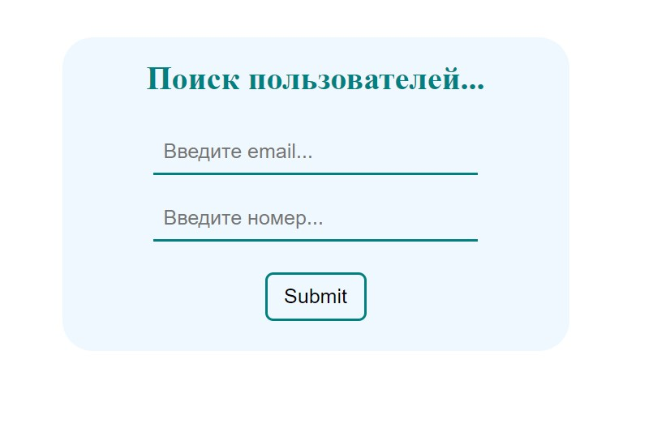
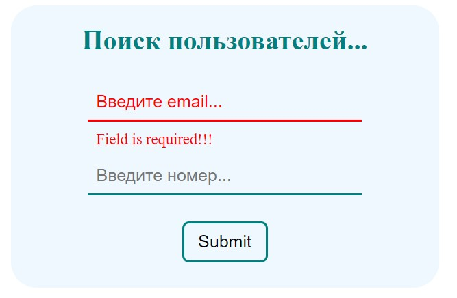
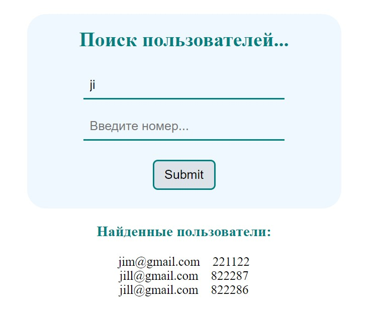
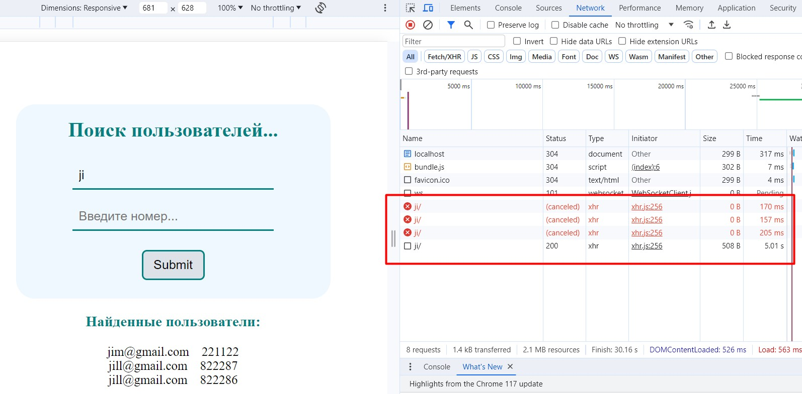
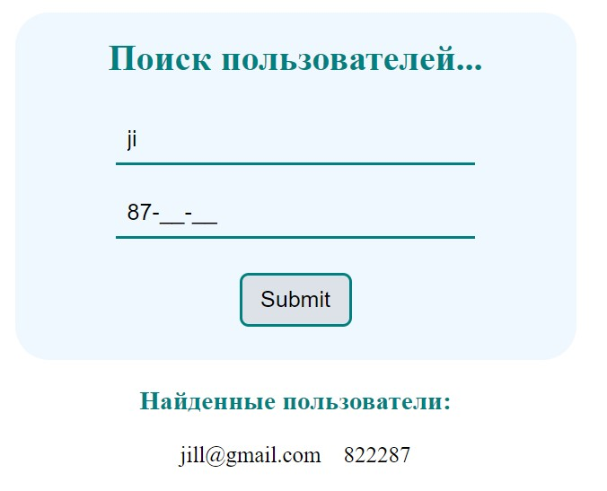
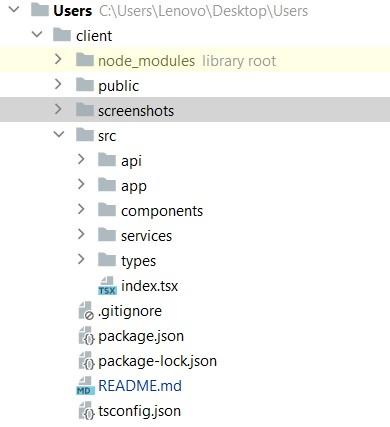

# Клиентская часть приложения поиска пользователей

## Запуск приложения

В папке проекта ***client*** запустите:

### `yarn start`

Запустится приложение в режиме разработки.\
Откройте [http://localhost:3000](http://localhost:3000) для просмотра в браузере.

## Описание приложения

Приложение имеет форму с 2-мя полями (***email, number***) и кнопкой (***submit***). Поле ***email*** является обязательным для заполнения, поле ***number*** является опциональным

Если не заполнить поле ***email***, форма выдаст ошибку о том, что данное поле обязательно для заполнения. Так как форма подразумевает поиск пользователей, а не регистрацию или логинизацию, достаточно ввести один символ по которому будет осуществляться поиск пользователей.

Пример ошибки при не заполненном email-е:

Чтобы избавиться от ошибки, начните вводить данные в поле ***email***.

В случае, если ввести хотя бы один символ в поле ***email*** и нажать кнопку ***Submit***, приложение выполнит запрос на бекэнд в поиске подходящего пользователя. Если подходящие пользователи найдутся, они списком выведутся под формой. В случае если пользователи не найдены, под формой появится соответствующее сообщение ***"Пользователи не найдены"***.

В момент выполнения запроса кнопка ***Submit*** не блокируется, однако если до ответа сервера нажать её ещё несколько раз, все предыдущие запросы будут отменены и выполнится только последний запрос.

Поле ***number*** имеет маску, по которой значения вводятся в него. Маска выглядит следующим образом ***"11-11-11"***.

При заполненных обоих полях пользователь ищется как по email-у, так и по номеру.

## Описание файловой структуры
Проект имеет следующие файлы и папки.

В папке ***screenshots*** расположены скриншоты для иструкции.\
В папке ***api*** расположен файл с настройками ***axios*** для запросов на сервер.\
В папке ***app*** расположен корневой компонент приложения.\
В папке ***components*** расположены компоненты для приложения.\
В папке ***services*** расположены вспомогательные сервисы для отделения логики бизнеса от UI.\
В папке ***types*** находится файл настройки для типизации.

## Описание логики взаимодействия
Приложение стартует в компоненте ***App***, в котором хранится состояние приложения, так как приложение небольшое с точки зрения управления данными.\
Компонент ***App*** отрисовывает внутри себя другие компоненты, такие как ***Input, Header, Button, User***. Получая данные из других компонент, ***App*** хранит их состояние в хуках useState.\
Для выполнения операций с асинхронным кодом ***App*** использует вспомогательную функцию ***findUsers***, которая занимается:
- логикой получения данных с сервера, используя вызов вспомогательного метода ***findUsers*** из объекта ***userAPI***; 
- выполняет логику прерывания предыдущих запросов если они есть.

Таким образом в случае появляения новых требований для приложения его легко расширить добавив новые методы для пользователей или других сущностей в файле конфигурации ***api*** или новые сервисы для взаимодействия с этими сущностями.