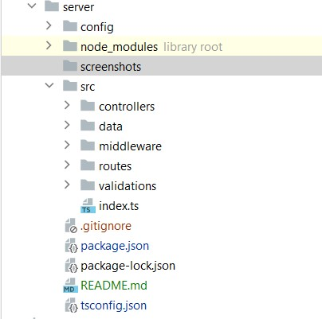

# Серверная часть приложения поиска пользователей

## Запуск приложения

В папке проекта ***server*** для режима разработки запустите:
### `npm run dev`

или для режима production запустите:
### `npm run start`

## Описание файловой структуры
Проект имеет следующие файлы и папки.

В папке ***screenshots*** расположены скриншоты для иструкции.\
В папке ***config*** расположен файл файл конфигурации, хранящий информацию для работы сервера.\
В папке ***controllers*** расположен файл описывающий логику получения и обработки данных.\
В папке ***data*** расположены данные.\
В папке ***middleware*** расположены промежуточные слои, необходимые для корректной работы сервера.\
В папке ***routes*** находится файл роутов, описывающий доступные end-поинты.

## Описание логики взаимодействия
Приложение начинает работу в файле ***index.ts***. Этот файл имеет функцию ***start***, которая необходима для оборачивания запуска сервера в try/catch для отлавливания потенциальных ошибок при запуске сервера.

Также сервер использует middleware ***cors*** для разрешения запросов к серверу и ***router*** для обработки входящих запросов.

Разделяя по отдельным сущностям роутер, контроллеры, middlewares мы можем легко расширять сервер, например валидация. Она выполнена в отдельной сущности и может применяться для будущих эндпоинтов.

Валидация выполнена на стороне сервера, потому что сервер является определяет условия и правила какие входные данные должны приходить к нему и соответствующим образом отсеивать не корректные запросы. В данном случае ожидаемое поле ***email*** проверяем на наличие минимум одного символа, так как служит оно лишь для поиска уже существующих пользователей.